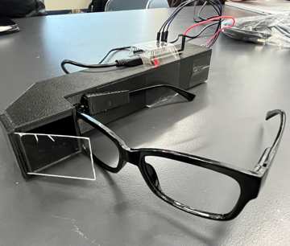
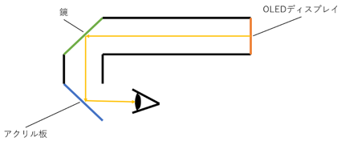

# SmartGlass

このリポジトリは，次のようなスマートグラスを作成した際のものです．

実際の構造は次のようになっています．ディスプレイを頭部後方に設置し，焦点距離を確保することで，長時間見続けても目が疲れないようになっています．

今回のスマートグラスは次のような機能を持っています．
- 現在の日付および時刻の表示
- 天気情報の取得

これらの情報を取得するためには，インターネット接続が必要となります．src/main.cppの2・３行目を参照し，アクセスポイントのSSIDおよびパスワードを書き換えてください．
